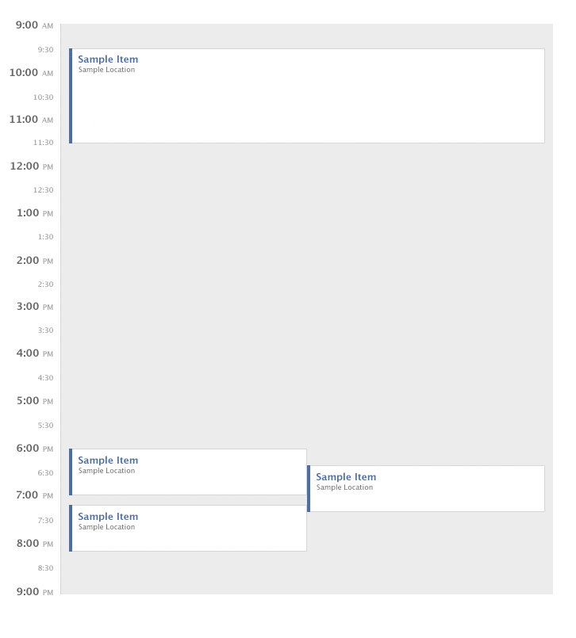

# Smartcar Frontend Challenge

The purpose of this challenge is to give us a sense of your skills. When assessing coding challenges, we consider a number of different metrics:

1. Does the application meet specifications? 
2. Is the code organized and intelligible?
3.  Does the code suggest an awareness of best practices? (modularity, 'DRY', time/space complexity ect)

Please keep these questions in mind as you work through the prompt.

## Instructions
Given a set of events, render the events on a single day calendar (similar to Outlook, Calendar.app, and Google Calendar). There are several properties of the layout:

1. No events may visually overlap.
2. If two events collide in time, they must have the same width.
3. An event should utilize the maximum width available, but rule #2 takes precedence over this rule.

Each event is represented by a JS object with a start and end attribute. The value of these attributes is the number of minutes since 9am. So `{start: 30, end: 90}` represents an event from 9:30am to 10:30am. The events should be rendered in a container that is 620px wide (600px + 10px padding on the left/right) and 720px high (the day will end at 9pm). The styling of the events should match the attached screenshot.

You may structure your code however you like, but you must implement the following function in the global namespace. The function takes in an array of events and will lay out the events according to the above description.

```js
/**
  * Lay out events for the day.
  * 
  * @param {Object[]} events the events to be layed out
  * @param {Number} events.start the number of minutes after 9am when the event starts
  * @param {Number} events.end the number of minutes after 9am when the event ends
  */
function layOutDay(events) {}
```
This function will be invoked from the console for testing purposes. If it cannot be invoked, the submission will be rejected.

In your submission, please implement the calendar with the following input:

```js
[
  {
    start: 30,
    end: 150
  },
  {
    start: 540,
    end: 600
  },
  {
    start: 560,
    end: 620
  },
  {
    start: 610,
    end: 670
  }
]
```
A screenshot of the expected output:



## FAQ
+ _Are frameworks such as JQuery, MooTools, etc. allowed?_
  + Yes, but please include the file with your source code.

+ _Is there a maximum bound on the number of events?_
  + You can assume a maximum of 100 events for rendering reasons, but your solution should be generalized.

+ _What browsers need to be supported?_
  + Your solution should work on all modern standards-compliant browsers.

+ _Does my solution need to match the image pixel for pixel?_
  + No, we will not be testing for pixel matching.

+ _How will you be testing my solution?_
  + We will be running tests from the browser console by invoking the `layOutDay()` function. Your solution should not require a local web server (e.g. run from localhost) or have any other dependencies besides your html/css/js.
